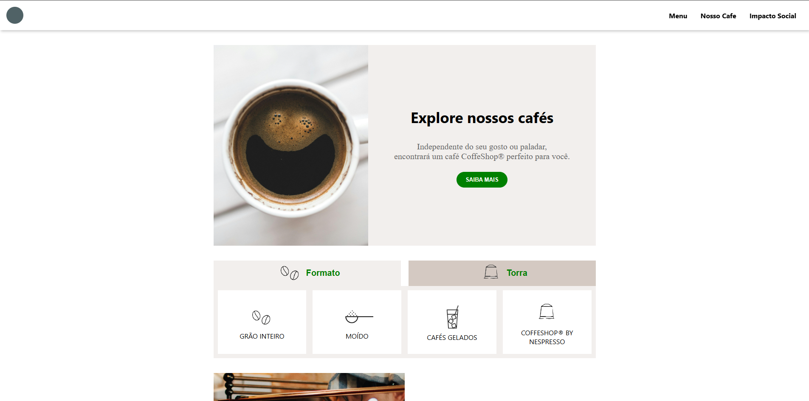

# ☕ Starbucks – Front-end Project

<div align="center">


</div>

<br/>

<div align="center">

<p>
Projeto front-end desenvolvido como parte do <strong>Mês 1 do cronograma de estudos</strong>, com foco em <strong>HTML semântico</strong>, <strong>CSS moderno</strong> e <strong>interatividade com JavaScript puro</strong>.  
A aplicação simula a página inicial da Starbucks, priorizando responsividade, organização de código e uma experiência de usuário consistente em diferentes dispositivos.
</p>

<br/>

<div>
  
  
  
  
  
</div>

</div>

---

## 📸 Preview do Projeto

<div align="center">



</div>

> Dica: use um print em desktop (largura ~1200px) ou um GIF curto mostrando o menu hambúrguer e a troca de seções.

---

## ✨ Funcionalidades

- Layout totalmente responsivo (mobile, tablet e desktop)
- Menu hambúrguer funcional para telas menores
- Alternância dinâmica entre categorias de produtos
- Estrutura organizada e reutilizável
- Hover effects sem impacto no layout
- Experiência visual consistente

---

## 🧠 Conceitos Aplicados

### HTML5
- Estrutura semântica
- Organização clara de seções
- Boas práticas de acessibilidade

### CSS3
- Flexbox e Grid Layout
- Media Queries
- Layout adaptativo
- Organização modular de estilos
- Controle de hover sem reflow do layout

### JavaScript (Vanilla)
- Manipulação do DOM
- Eventos de clique
- Alternância de estados visuais
- Lógica simples e previsível
- Separação clara de responsabilidades

### Git & GitHub
- Versionamento desde o início
- Commits incrementais
- Organização de repositório para portfólio

---

## 🚀 Objetivo do Projeto

Consolidar os fundamentos de **HTML, CSS e JavaScript** em um único projeto prático, simulando um cenário real de desenvolvimento front-end e demonstrando capacidade de construir interfaces responsivas e interativas do zero.

---

## 📂 Como executar o projeto

```bash
git clone https://github.com/seu-usuario/seu-repositorio.git
cd seu-repositorio
